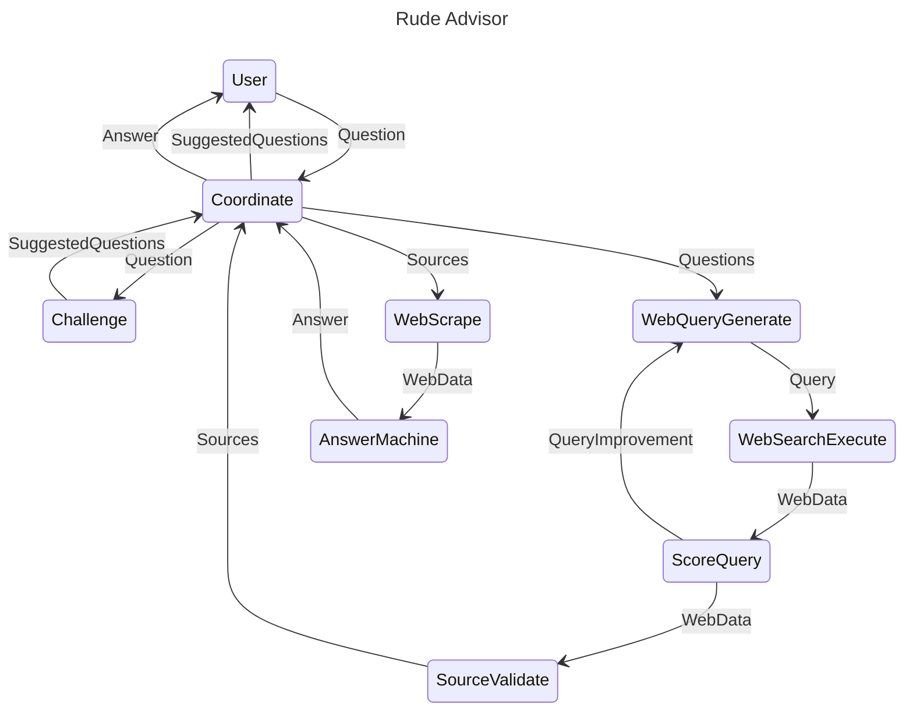

# Disclaimer

**This project is for educational and experimental purposes only. Do not use this project for any serious or critical applications. The authors are not responsible for any misuse or damage caused by using this software.**

# RudeAdvisor

RudeAdvisor is a personal learning project focused on understanding Large Language Models (LLMs), agent patterns, and antipatterns. The primary aim is to explore these concepts with minimal use of frameworks, relying on basic Python dependencies. The project intentionally use alot of  procedural patterns, aiming for a more functional and immutable approach to code design. 

## Key Principles
1. **Frameworks vs Libraries**: Leverage as few frameworks as possible to maintain simplicity and clarity (or expose complexities that is handled by frameworks)  
2. **Functional vs. Object oriented approach**: Few state mutations, adopting immutable data structures and pure functions whenever possible. We are in Python so we will never be pure FF..   

## Goals
- Gain hands-on experience and deep understanding of LLMs.
- Explore and identify patterns and antipatterns in agent-based systems.
- Develop a strong foundation in writing clean, maintainable, and functional code in Python.

## State diagram


## Features

- **Web Search:** Uses DuckDuckGo for searching the web and retrieving relevant results based on user queries.
- **Web Scraping:** Scrapes websites and PDFs to extract textual data for analysis.
- **Question Evaluation:** Assesses and scores questions based on predefined criteria.
- **Question Refinement:** Refines and challenges existing questions to generate more focused and relevant queries.
- **AI Integration:** Uses OpenAI's GPT models to generate answers, evaluate sources, and more.

## Installation

### Python project 

```bash
# Clone this repository
git clone https://github.com/tarjeir/eduadvisor.git

# Navigate to the project directory
cd rudeadvisor

# Install dependencies
pip install -r requirements.txt
```

### Redis

Install Redis

- Official Install Instructions: https://redis.io/docs/latest/operate/oss_and_stack/install/install-redis/
- Docker: https://redis.io/kb/doc/1hcec8xg9w/how-can-i-install-redis-on-docker

### Open AI platform token 

Set Up Your API Key as an Environment Variable

```sh
export OPENAI_API_KEY='your-openai-api-key'
```

### Usage

### Running the Server

RudeAdvisor includes a FastAPI server for interfacing with the platform's functionalities. To start the server:

```bash
python rudeadvisor/runner.py
```

### App

Once the server is running, you can access the API documentation at `http://127.0.0.1:8000/`.

### API Documentation

Once the server is running, you can access the API documentation at `http://127.0.0.1:8000/docs`.

### License

This project is licensed under the MIT License. See the `LICENSE` file for more details.

