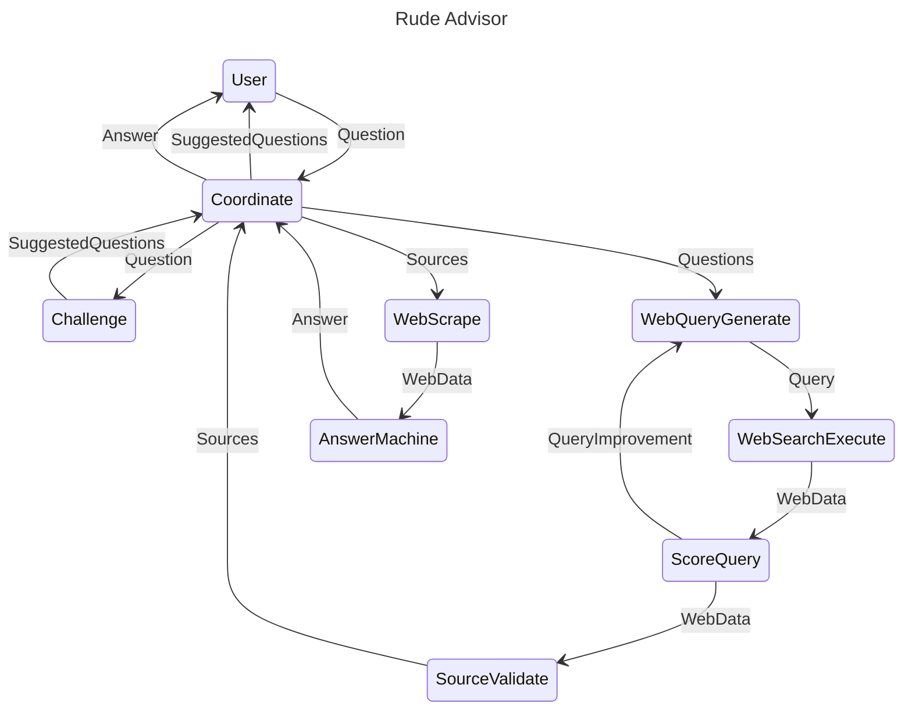

## RudeAdvisor

RudeAdvisor is a Python-based platform designed to facilitate and automate various tasks related to web scraping, search querying, question evaluation, and leveraging AI to generate answers and refine questions.

### State diagram


### Features

- **Web Search:** Uses DuckDuckGo for searching the web and retrieving relevant results based on user queries.
- **Web Scraping:** Scrapes websites and PDFs to extract textual data for analysis.
- **Question Evaluation:** Assesses and scores questions based on predefined criteria.
- **Question Refinement:** Refines and challenges existing questions to generate more focused and relevant queries.
- **AI Integration:** Uses OpenAI's GPT models to generate answers, evaluate sources, and more.

### Installation

#### Python project 

```bash
# Clone this repository
git clone https://github.com/tarjeir/eduadvisor.git

# Navigate to the project directory
cd eduadvisor

# Install dependencies
pip install -r requirements.txt
```

#### Redis

Install Redis

- Official Install Instructions: https://redis.io/docs/latest/operate/oss_and_stack/install/install-redis/
- Docker: https://redis.io/kb/doc/1hcec8xg9w/how-can-i-install-redis-on-docker

#### Open AI platform token 

Set Up Your API Key as an Environment Variable

```sh
export OPENAI_API_KEY='your-openai-api-key'
```

### Usage

### Running the Server

RudeAdvisor includes a FastAPI server for interfacing with the platform's functionalities. To start the server:

```bash
python eduadvisor/runner.py
```

### App

Once the server is running, you can access the API documentation at `http://127.0.0.1:8000/`.

### API Documentation

Once the server is running, you can access the API documentation at `http://127.0.0.1:8000/docs`.

### Disclaimer

**This project is for educational and experimental purposes only. Do not use this project for any serious or critical applications. The authors are not responsible for any misuse or damage caused by using this software.**

### License

This project is licensed under the MIT License. See the `LICENSE` file for more details.


